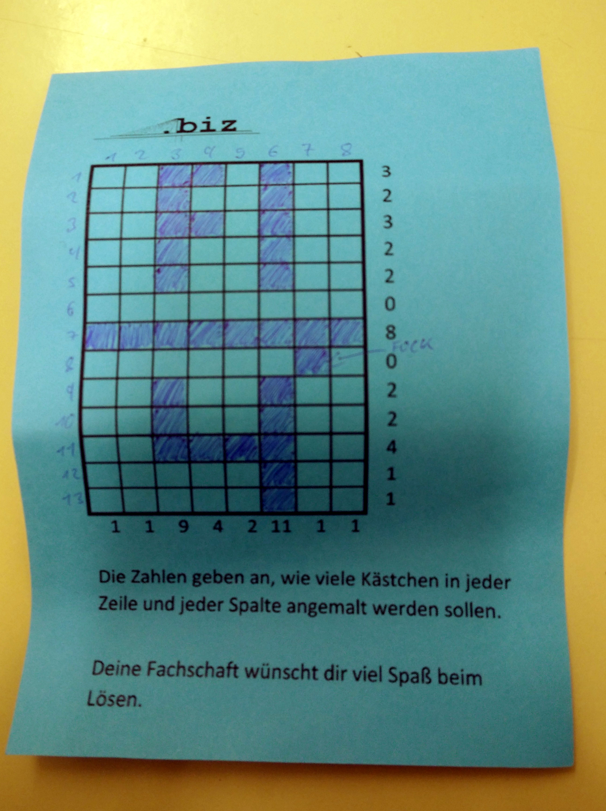

# Biz constraint puzzle

Solves the biz constraint puzzle

# Usage

```bash
$ clingo first.lp biz.lp| ./visualizer.py 
  ██ █  
  █  █  
  ██ █  
  █  █  
  █  █  
        
████████
        
  █  █  
  █  █  
  ████  
     █  
     █  
```

# Example puzzle

See `first.lp` for encoding


